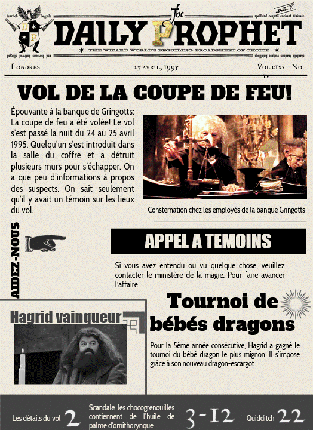

<figure>
<figcaption>Rappel de la structure de la base de données</figcaption>
</figure>

# Le vol de la coupe de feu 
Lis la une du journal:
<figure>
<figcaption>Une copie de la une de "The Daily Prophet"</figcaption>
</figure>

## Le témoin

L'appel à témoins a bien fonctionné. C'est l'épouse du témoin qui s'est annoncée elle s'appelle Narcissa Malefoy.

<sql-exercise
  data-question="1. Écris une commande pour trouver le témoin de l'affaire."
  data-comment="Essaie de ne pas utiliser la solution et demande à un/e assistant/e si tu as besoin d'aide."
  data-default-text="SELECT ..."
  data-hint="SELECT ...
  FROM famille
  ... second_nom = ... ... relation = ..."
  data-solution="
  SELECT premier_nom 
  FROM famille 
  WHERE second_nom = 'Narcissa Malefoy' AND relation = 'Époux'" 
  ></sql-exercise>

<input-feedback 
data-title="Écris le nom du témoin si tu penses l'avoir trouvé."
data-solution="lucius malefoy"
success-message="En effet c'est bien Lucius Malefoy ! Tu lui envoies donc un message par chouette express pour lui demander des informations sur le vol et il te répond ceci:
Chère inspectrice, je me promenais dans le chemin de traverse avec ma femme Narcissa après minuit lorsque j'ai entendu un bruit fracassant. J'ai dit à ma femme de s'enfuir, mais je voulais rester quelques instants pour comprendre ce qu'il se passait. Comme il faisait nuit, je n'ai pas très bien vu, mais il me semble que j'ai vu deux individus qui se battaient devant la banque Gringotts. Il y avait une femme aux cheveux bruns ou noirs et un homme aux cheveux noirs. Au bout de quelques secondes, la femme s'est envolée avec son balais et des détraqueurs ont continué à se battre avec l'homme. À court de ressources, l'homme a appelé son patronus pour le défendre contre les détraqueurs. C'était une biche. Je me suis ensuite enfuis."
failure-message="Ce n'est pas la bonne personne, essaie à nouveau."></input-feedback>

## Le combattant

<sql-exercise
  data-question="Grâce au récit du témoin, arriveras-tu à retrouver l'homme qui se battait."
  data-comment="Si tu as besoin d'un peu d'aide tu peux cliquer sur INDICE, un indice apparaitra."
  data-default-text="SELECT ..."
  data-hint="Il faut que tu trouves un personnage homme, 
  avec les cheveux noirs et un patronus de biche. 
  Fais attention aux majuscules lorsque tu écris les attributs."
  data-solution="
  SELECT nom 
  FROM personnages
  WHERE genre='Homme' AND cheveux='Noirs' AND patronus='Biche' "
  ></sql-exercise>

<input-feedback 
data-title="Penses-tu avoir trouvé le nom de la personne présente sur les lieux du crime?"
data-solution="severus rogue"
success-message="Oui, c'est bien Severus Rogue! Vous le contactez pour plus d'informations et il vous répond qu'il ne se souvient plus bien de la scène car il a reçu un sort qui lui a fait oublié la plupart des choses. Mais il se souvient que qu'il se battait contre quelqu'un qui avait un aire de famille avec Sirius Black. De plus il ou elle avait certainement l'air d'avoir plus de 40 ans. "
failure-message="Ce n'est pas la bonne personne, essaie à nouveau."></input-feedback>

## Le/la coupable

<sql-exercise
  data-question="Tu as maintenant toutes les informations nécessaires pour trouver le ou la coupable du vol de la coupe de feu!"
  data-comment="Essaie d'écrire toutes les informations que tu as sur un bout de papier. Puis clique sur INDICE pour vérifier que tu as bien tout trouvé. Essaie finalement d'écrire une requête qui filtre toutes les conditions une par une, puis toutes ensembles."
  data-default-text="SELECT ..."
  data-hint="Les informations que tu as pu récolter jusqu'à présent sont: 
  une femme, 
  avec des cheveux noirs ou bruns, 
  elle est de famille avec Sirius Black, 
  elle est née avant 1955 (elle a plus de 40 ans et il est noté au début de l'enquête que nous sommes en 1995). 
  N'oublie pas qu'elle doit aussi être encore en vie au moment du vol."
  data-solution="
Il vaut mieux détacher la commande en plusieurs parties
mais voici une manière de trouver la coupable en une seule commande.
SELECT nom 
FROM personnages 
WHERE nom IN (SELECT premier_nom
                              FROM famille
                              WHERE second_nom='Sirius Black')
AND genre='Femme' 
AND (cheveux='Noirs' OR cheveux='Bruns')
AND naissance < 1955 
AND mort > 1995"
  ></sql-exercise>

<input-feedback 
data-title="As-tu réussi à découvrir qui était le ou la coupable du vol?"
data-solution="bellatrix lestrange"
success-message="Excellent! Tu as trouvé la coupable: Bellatrix Lestrange. Grâce à toi la coupe de feu a pu être récupérée et le tournoi de la coupe de feu pourra avoir lieu, comme prévu à Poudlard."
failure-message="Ce n'est pas la bonne personne, essaies à nouveau ou demande de l'aide."></input-feedback>

Si tu as envie d'en apprendre un peu plus sur le SQL, tu peux essayer les défis supplémentaires sur la prochaine page.
